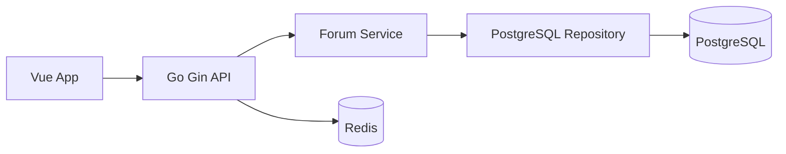

# 选科π架构说明

## 目标

选科π是一个面向中国高一学生和家长的选科主题论坛。第一阶段目标是搭建可长期演进的前后端分离工程，支持帖子、评论、选科组合筛选、数据建议和本地开发环境。

## 技术栈

- Frontend: Vue 3, Vite, TypeScript, Pinia, TanStack Query, ECharts, lucide icons
- Backend: Go, Gin, pgx, PostgreSQL, Redis, zap
- Local runtime: Docker Compose
- Data model: posts, comments, subject_insights, users

## 目录边界

```text
subject-choice-forum/
  frontend/                 Vue 3 单页应用
  backend/                  Go API 服务
    cmd/api/                API 入口
    internal/config/        环境配置
    internal/domain/        领域模型
    internal/http/          Gin 路由、handler、中间件
    internal/repository/    PostgreSQL 仓储实现
    internal/service/       业务服务层
    internal/storage/       外部存储连接
    migrations/             数据库初始化 SQL
  deployments/              生产部署辅助配置
  docs/                     架构、设计和后续规划
  scripts/                  本地启动与测试脚本
```

## 请求链路



## API 初版

- `GET /healthz`
- `GET /readyz`
- `GET /api/v1/taxonomy`
- `GET /api/v1/insights`
- `GET /api/v1/posts`
- `POST /api/v1/posts`
- `GET /api/v1/posts/:id`
- `POST /api/v1/posts/:id/comments`

## 后续企业级演进

1. 用户系统：手机号/微信登录、家长与学生身份、学校认证。
2. 内容治理：敏感词、举报、审核流、低质内容降权。
3. 推荐系统：按省份、成绩段、目标专业、浏览行为做个性化推荐。
4. 数据平台：接入各省考试院和高校专业组选科要求，建立版本化数据仓库。
5. 可观测性：OpenTelemetry、Prometheus、Grafana、结构化审计日志。
6. CI/CD：GitHub Actions、镜像扫描、自动迁移、灰度发布。
