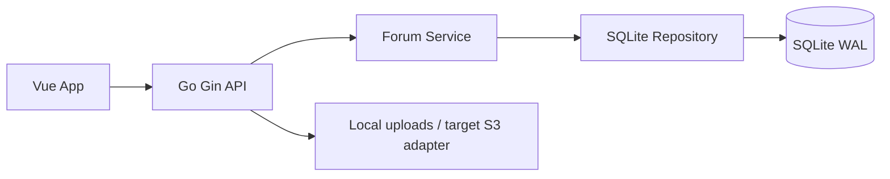

# 选科π架构说明

## 目标

选科π是一个面向中国高一学生和家长的选科主题论坛。当前阶段目标是在不重写 Vue 3 + Go/Gin 业务的前提下，把公测所需的认证、数据来源、上传、治理、契约和验收能力补齐。

## 技术栈

- Frontend: Vue 3, Vite, TypeScript, Pinia, TanStack Query, ECharts, lucide icons
- Backend: Go, Gin, SQLite repository, structured HTTP middleware
- Current runtime: single Linux process with SQLite WAL and local upload directory
- Public beta target: managed PostgreSQL 16 via goose migrations, S3-compatible object storage, no Redis in this round
- Data model: users, sessions, posts, comments, messages, notifications, admin content, reports, sources, policies, requirements, upload assets

## 目录边界

```text
subject-choice-forum/
  frontend/                 Vue 3 单页应用
  backend/                  Go API 服务
    main.go                 API 入口
    internal/config/        环境配置
    internal/domain/        领域模型
    internal/http/          Gin 路由、handler、中间件
    internal/repository/    SQLite 与 PostgreSQL 仓储实现及运行时 factory
    internal/service/       业务服务层
    internal/storage/       SQLite 初始化和连接
    migrations/postgres/    goose 管理的 PostgreSQL 16 目标 schema
  deploy/                   生产部署辅助配置
  docs/                     架构、设计和后续规划
  scripts/                  本地启动与测试脚本
```

## 请求链路


```mermaid
flowchart LR
  Browser["Vue App"] --> API["Go Gin API"]
  API --> Service["Forum Service"]
  Service --> Repo["SQLite Repository"]
  Repo --> DB[(SQLite WAL)]
  API --> Uploads["Local uploads / target S3 adapter"]
```

## API 初版

- `GET /healthz`
- `GET /readyz`
- `GET /api/v1/taxonomy`
- `GET /api/v1/insights`
- `GET /api/v1/posts`
- `POST /api/v1/posts`
- `GET /api/v1/posts/:id`
- `POST /api/v1/posts/:id/comments`

## 公测架构演进

1. 数据库：以 `backend/migrations/postgres/000001_public_beta_schema.sql` 作为 PostgreSQL 16 baseline，CI 使用 goose 验证 up/down；运行时 factory 在本地/测试选择 SQLite、生产选择 PostgreSQL。SQLite -> PostgreSQL 迁移器已完成两次真实 PostgreSQL 16 演练，PostgreSQL repository 核心用户主链路已有集成测试；托管实例最终切换、完整 HTTP/后台和性能验收仍待完成。
2. 对象存储：上传接口已按 asset key 与完成态建模；生产目标是 S3 兼容对象存储和 CDN，现有本地存储仍是开发/过渡实现。
3. 认证治理：用户和管理员均走可撤销服务端会话 Cookie；内容举报、审核、隐藏/恢复、封禁和审计日志作为公测治理基础。
4. 数据平台：公开 API 提供省份覆盖、政策、专业要求和来源追溯；广东以外不生成未经复核的结构化结论。
5. 可观测性：已有 requestId、JSON 脱敏日志、Prometheus、可选 OpenTelemetry OTLP/HTTP traces、告警和运行状态面板。请求 span 仅记录路由模板、方法、状态码和 requestId，不采集请求体、查询参数、邮箱或凭证；未配置 endpoint 时 tracing 完全禁用。
6. CI/CD：GitHub Actions 已覆盖后端、前端、OpenAPI、E2E、安全扫描、SBOM、k6 smoke 和 PostgreSQL migration gate；灰度发布和正式压测证据仍待补齐。
